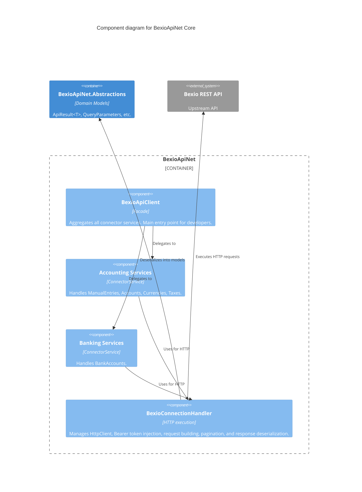

# Internal Library Components: BexioApiNet Core

This diagram details the internal structure of the `BexioApiNet` implementation project and how requests are processed.

## C4 Component Diagram

## Component Breakdown

| Component | Responsibility | Path |
|-----------|----------------|------|
| **BexioApiClient** | Facade implementing `IBexioApiClient`. Provides convenient properties (e.g., `AccountingManualEntries`, `BankingBankAccounts`) to access specific service areas. | `src/BexioApiNet/Services/BexioApiClient.cs` |
| **Connector Services** | Concrete services inheriting from `ConnectorService` (e.g., `ManualEntryService`, `BankAccountService`). They construct specific API paths (using structures like `ManualEntryConfiguration`) and define typed methods for GET, POST, DELETE. | `src/BexioApiNet/Services/Connectors/` |
| **BexioConnectionHandler** | Implements `IBexioConnectionHandler`. Wraps `HttpClient`. Applies authorization and accept headers. Contains robust methods for fetching single objects, executing multipart file uploads, and auto-paginating through collection endpoints. | `src/BexioApiNet/Services/BexioConnectionHandler.cs` |
| **Query Parameters** | Wrappers for dictionary-based optional URL queries. Handled systematically by the `BexioConnectionHandler` during URL construction. | `src/BexioApiNet/Models/` |
