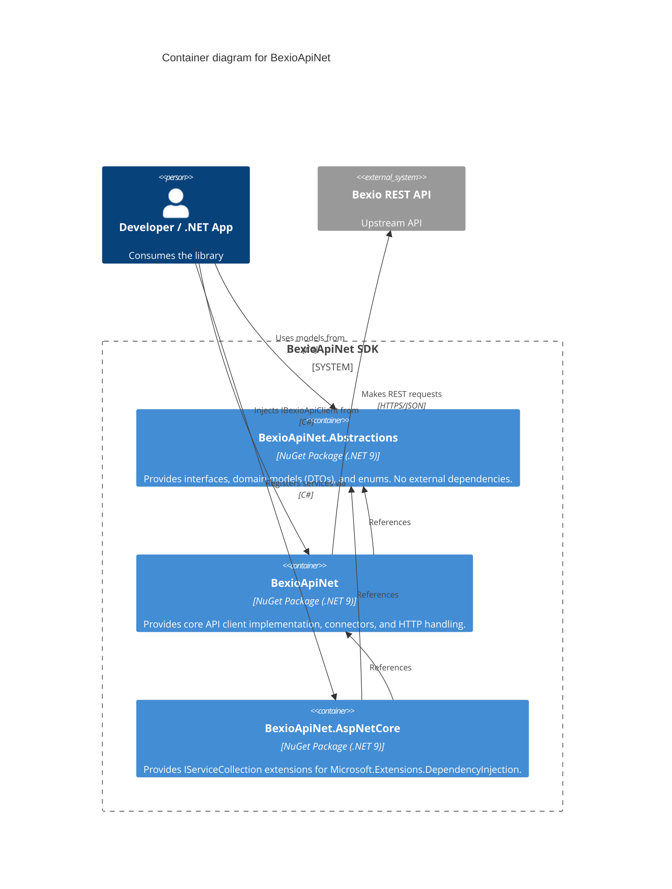

# Container Architecture: BexioApiNet

The BexioApiNet solution is partitioned into separate NuGet packages to minimize dependencies and strictly separate domain definitions from ASP.NET Core integrations.

## C4 Container Diagram

## Deployable Units

| Container | Path | Responsibility |
|-----------|------|----------------|
| **BexioApiNet.Abstractions** | `src/BexioApiNet.Abstractions/` | Defines the contract. Contains all domain models mapped to the Bexio API schema, enums (like `ApiResponseCodes`), exceptions, and connector interfaces. |
| **BexioApiNet** | `src/BexioApiNet/` | The actual implementation. Contains the `BexioConnectionHandler` (HTTP client logic) and service implementations (e.g., `ManualEntryService`, `AccountService`). |
| **BexioApiNet.AspNetCore** | `src/BexioApiNet.AspNetCore/` | A lightweight wrapper adding ASP.NET Core dependency injection compatibility (`AddBexioServices()`). |
| **BexioApiNet.Tests** | `src/BexioApiNet.Tests/` | *Not deployed.* NUnit integration tests validating real API calls against Bexio. |
