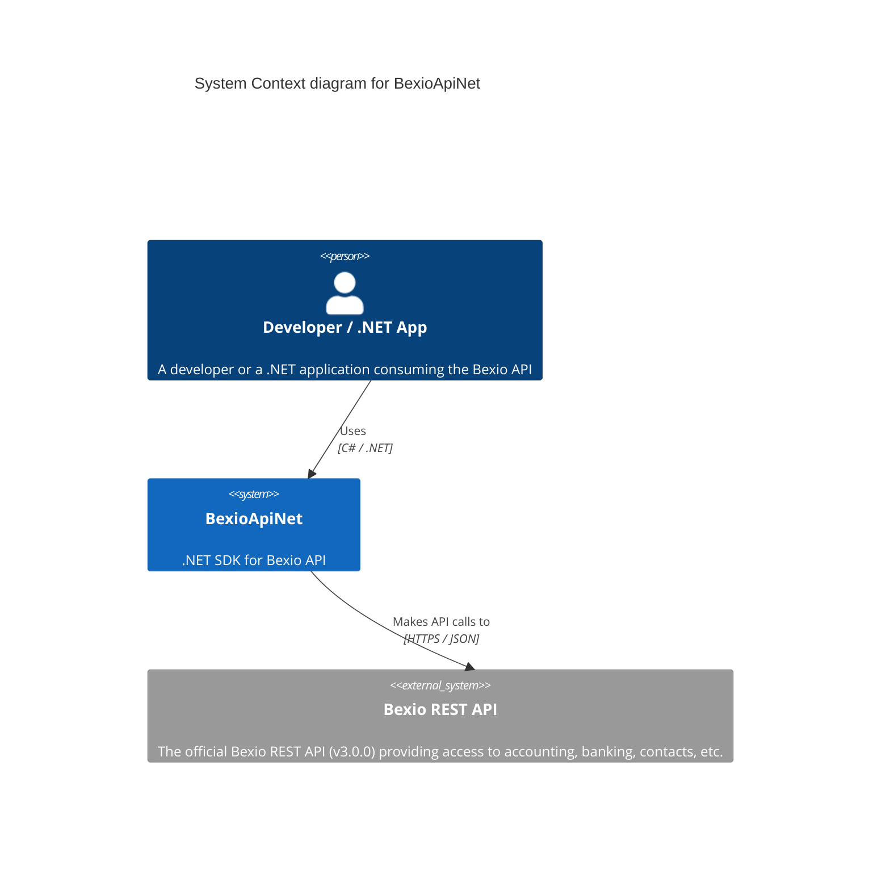

# System Context: BexioApiNet

BexioApiNet acts as a bridge between .NET applications and the Bexio REST API, encapsulating HTTP communication, authentication, and error handling.

## C4 System Context Diagram

## Actors

| Actor | Description |
|-------|-------------|
| Developer / .NET App | Any third-party application or developer that needs to integrate with Bexio to manage accounting, taxes, or banking data. |

## External Systems

| System | Description |
|--------|-------------|
| Bexio REST API | The upstream SaaS platform API that manages the actual business data. |
